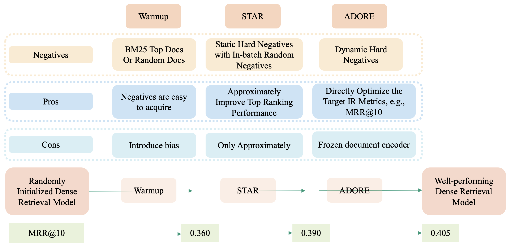

# Optimizing Dense Retrieval Model Training with Hard Negatives
Jingtao Zhan, Jiaxin Mao, Yiqun Liu, Jiafeng Guo, Min Zhang, Shaoping Ma

* 🔥**News 2021-10: Our full paper, [Learning Discrete Representations via Constrained Clustering for Effective and Efficient Dense Retrieval](https://arxiv.org/abs/2110.05789) \[[code](https://github.com/jingtaozhan/RepCONC)\], was accepted by WSDM'22. It presents RepCONC and achieves state-of-the-art first-stage retrieval effectiveness-efficiency tradeoff. Part of its training foundation lies in this repo (STAR and ADORE).**

* 🔥**News 2021-8: Our full paper, [Jointly Optimizing Query Encoder and Product Quantization to Improve Retrieval Performance](https://arxiv.org/abs/2108.00644) \[[code](https://github.com/jingtaozhan/JPQ)\], was accepted by CIKM'21. It presents JPQ and greatly improves the efficiency of Dense Retrieval. Part of its training foundation lies in this repo (dynamic hard negatives).**

This repo provides code, retrieval results, and trained models for our SIGIR Full paper [Optimizing Dense Retrieval Model Training with Hard Negatives](https://arxiv.org/abs/2104.08051). The previous version is [Learning To Retrieve: How to Train a Dense Retrieval Model Effectively and Efficiently.](https://arxiv.org/abs/2010.10469)

We achieve very impressive retrieval results on both passage and document retrieval bechmarks. The proposed two algorithms (STAR and ADORE) are very efficient. IMHO, they are well worth trying and most likely improve your retriever's performance by a large margin. 

The following figure shows the pros and cons of different training methods. You can train an effective Dense Retrieval model in three steps. Firstly, warmup your model using random negatives or BM25 top negatives. Secondly, use our proposed STAR to train the query encoder and document encoder. Thirdly, use our proposed ADORE to train the query encoder. 


## Retrieval Results and Trained Models

| Passage Retrieval | Dev MRR@10  | Dev R@100 | Test NDCG@10 | Files |
|---------------- | ------------|-------| ------- | ------ |
| Inbatch-Neg     | 0.264 | 0.837 | 0.583 | [Model](https://drive.google.com/drive/folders/1ncFKzr4lz9qdI9ZXEi4AosQ_A900ELBz?usp=sharing) |
| Rand-Neg     | 0.301 | 0.853 | 0.612 | [Model](https://drive.google.com/drive/folders/1BJNYcUiFh-Ukc2fibw-3NwPNnAYCZgO9?usp=sharing) |
| STAR     | 0.340 | 0.867 | 0.642 | [Model](https://drive.google.com/drive/folders/1bJw8P15cFiV239mTgFQxVilXMWqzqXUU?usp=sharing) [Train](https://drive.google.com/file/d/1FRFTsqmU95IQHYHJ_q5SDCWVnxbWlIXi/view?usp=sharing) [Dev](https://drive.google.com/file/d/1QkPYmpvI3PX3vWZEO4zsEcoxLipIEsHA/view?usp=sharing) [TRECTest](https://drive.google.com/file/d/1VBPJKKrkZw7RAS5gUJX--lb6Qsu-72D8/view?usp=sharing) |
| ADORE (Inbatch-Neg) | 0.316 | 0.860 | 0.658 | [Model](https://drive.google.com/drive/folders/1Kuwnit7SBoMVZ6s2Mz9RAORQlYU6zG8K?usp=sharing) |
| ADORE (Rand-Neg) | 0.326 | 0.865 | 0.661 | [Model](https://drive.google.com/drive/folders/1U8Nq_LLyVZPh26_ldnSAvsYNk7g43IkE?usp=sharing) |
| ADORE (STAR) | 0.347 | 0.876 | 0.683 | [Model](https://drive.google.com/drive/folders/1C1GQGfI4UHg99rfRcPYzQxlGZXvtsDfm?usp=sharing) [Train](https://drive.google.com/file/d/1zJTPwnUdX_1vkcaQ4SLwtF4L-h24oQOg/view?usp=sharing) [Dev](https://drive.google.com/file/d/1pm4pRimapKZDVqnvLpiYFmgBRKdKlJZW/view?usp=sharing) [TRECTest](https://drive.google.com/file/d/19Vp57INLBszrO6qk6eCfcaH3oY-5HDKR/view?usp=sharing) [Leaderboard](mailto:jingtaozhan@gmail.com)|


| Doc Retrieval | Dev MRR@100  | Dev R@100 | Test NDCG@10 | Files |
|---------------- | ------------|-------| ------- | ------ |
| Inbatch-Neg     | 0.320 | 0.864 | 0.544 | [Model](https://drive.google.com/drive/folders/1wQ6bCH8TjNxazVoKW08DmggPOjO2-Y-H?usp=sharing) |
| Rand-Neg     | 0.330 | 0.859 | 0.572 | [Model](https://drive.google.com/drive/folders/15oGEZbOeqWz0k77R_xE26VBwcEo4VJuE?usp=sharing) |
| STAR     | 0.390 | 0.867 | 0.605 | [Model](https://drive.google.com/drive/folders/18GrqZxeiYFxeMfSs97UxkVHwIhZPVXTc?usp=sharing) [Train](https://drive.google.com/file/d/1Gcp7dbAzpslIIaV_KFkZg4UOkp0ev_eL/view?usp=sharing) [Dev](https://drive.google.com/file/d/17yR6BRLzfW1bxr-VaQ2w2cKpClgcFTej/view?usp=sharing) [TRECTest](https://drive.google.com/file/d/1Mh2BtPYvXRnT2Uz2ZYALZuXQQq3IHApS/view?usp=sharing) |
| ADORE (Inbatch-Neg) | 0.362 | 0.884 | 0.580 | [Model](https://drive.google.com/drive/folders/1Lvz8aLZyzqm9faCWzoQfJJwbL4vdZu2l?usp=sharing) |
| ADORE (Rand-Neg) | 0.361 | 0.885 | 0.585 | [Model](https://drive.google.com/drive/folders/1gH5pTfqBkComxPXhFgdbPRD9r1vZWYZO?usp=sharing) |
| ADORE (STAR) | 0.405 | 0.919 | 0.628 | [Model](https://drive.google.com/drive/folders/1p9FZ8iqqZ9rsfgDzntlNBVKNEf7-2Hih?usp=sharing) [Train](https://drive.google.com/file/d/1XGXdo6LG8VwHvtCbevbvmu3GkwPiV_NC/view?usp=sharing) [Dev](https://drive.google.com/file/d/1vY_q-jzU0CHhOtv_UIYSDkU-l6Kj8fEX/view?usp=sharing) [TRECTest](https://drive.google.com/file/d/1N1ouaMgNdPhjqJMXUBOU5Rg28_T7wapv/view?usp=sharing) [Leaderboard](mailto:jingtaozhan@gmail.com)|

If you want to use our first-stage leaderboard runs, [contact me](mailto:jingtaozhan@gmail.com) and I will send you the file.

If any links fail or the files go wrong, please contact me or open a issue.

## Requirements

To install requirements, run the following commands:

```setup
git clone git@github.com:jingtaozhan/DRhard.git
cd DRhard
python setup.py install
```
However, you need to set up a new python enverionment for data preprocessing (see below).

## Data Download
To download all the needed data, run:
```
bash download_data.sh
```

## Data Preprocess
You need to set up a new environment with `transformers==2.8.0` to tokenize the text. This is because we find the tokenizer behaves differently among versions 2, 3 and 4. To replicate the results in our paper with our provided trained models, it is necessary to use version `2.8.0` for preprocessing. Otherwise, you may need to re-train the DR models. 

Run the following codes.
```bash
python preprocess.py --data_type 0; python preprocess.py --data_type 1
```

## Inference
With our provided trained models, you can easily replicate our reported experimental results. Note that minor variance may be observed due to environmental difference. 

### STAR
The following codes use the provided STAR model to compute query/passage embeddings and perform similarity search  on the dev set. (You can use `--faiss_gpus` option to use gpus for much faster similarity search.)
```bash
python ./star/inference.py --data_type passage --max_doc_length 256 --mode dev   
python ./star/inference.py --data_type doc --max_doc_length 512 --mode dev   
```

Run the following code to evaluate on MSMARCO Passage dataset.
```bash
python ./msmarco_eval.py ./data/passage/preprocess/dev-qrel.tsv ./data/passage/evaluate/star/dev.rank.tsv
```
```bash
Eval Started
#####################
MRR @10: 0.3404237731386721
QueriesRanked: 6980
#####################
```

Run the following code to evaluate on MSMARCO Document dataset.
```bash
python ./msmarco_eval.py ./data/doc/preprocess/dev-qrel.tsv ./data/doc/evaluate/star/dev.rank.tsv 100
```
```bash
Eval Started
#####################
MRR @100: 0.3903422772218344
QueriesRanked: 5193
#####################
```

### ADORE

ADORE computes the query embeddings. The document embeddings are pre-computed by other DR models, like STAR. The following codes use the provided ADORE(STAR) model to compute query embeddings and perform similarity search  on the dev set. (You can use `--faiss_gpus` option to use gpus for much faster similarity search.)

```bash
python ./adore/inference.py --model_dir ./data/passage/trained_models/adore-star --output_dir ./data/passage/evaluate/adore-star --preprocess_dir ./data/passage/preprocess --mode dev --dmemmap_path ./data/passage/evaluate/star/passages.memmap
python ./adore/inference.py --model_dir ./data/doc/trained_models/adore-star --output_dir ./data/doc/evaluate/adore-star --preprocess_dir ./data/doc/preprocess --mode dev --dmemmap_path ./data/doc/evaluate/star/passages.memmap
```

Evaluate ADORE(STAR) model on dev passage dataset:
```bash
python ./msmarco_eval.py ./data/passage/preprocess/dev-qrel.tsv ./data/passage/evaluate/adore-star/dev.rank.tsv
```
You will get
```bash
Eval Started
#####################
MRR @10: 0.34660697230181425
QueriesRanked: 6980
#####################
```

Evaluate ADORE(STAR) model on dev document dataset:
```bash
python ./msmarco_eval.py ./data/doc/preprocess/dev-qrel.tsv ./data/doc/evaluate/adore-star/dev.rank.tsv 100
```
You will get
```bash
Eval Started
#####################
MRR @100: 0.4049777020859768
QueriesRanked: 5193
#####################
```

### Convert QID/PID Back
Our data preprocessing reassigns new ids for each query and document. Therefore, you may want to convert the ids back. We provide a script for this. 

The following code shows an example to convert ADORE-STAR's ranking results on the dev passage dataset.
```bash
python ./cvt_back.py --input_dir ./data/passage/evaluate/adore-star/ --preprocess_dir ./data/passage/preprocess --output_dir ./data/passage/official_runs/adore-star --mode dev --dataset passage
python ./msmarco_eval.py ./data/passage/dataset/qrels.dev.small.tsv ./data/passage/official_runs/adore-star/dev.rank.tsv
```
You will get
```bash
Eval Started
#####################
MRR @10: 0.34660697230181425
QueriesRanked: 6980
#####################
```

## Train
In the following instructions, we show how to replicate our experimental results on MSMARCO Passage Retrieval task. 

### STAR
We use the same warmup model as ANCE, the most competitive baseline, to enable a fair comparison. Please download [it](https://drive.google.com/file/d/1URYU1gxNgcuC81jPAev1ksZjMKgQQFoD/view?usp=sharing) and extract it at `./data/passage/warmup`

Next, we use this warmup model to extract static hard negatives, which will be utilized by STAR. 
```bash
python ./star/prepare_hardneg.py \
--data_type passage \
--max_query_length 32 \
--max_doc_length 256 \
--mode dev \
--topk 200
```
It will automatically use all available gpus to retrieve documents. If all available cuda memory is less than 26GB (the index size), you can add `--not_faiss_cuda` to use CPU for retrieval. 

Run the following command to train the DR model with STAR. In our experiments, we only use one GPU to train.
```bash
python ./star/train.py --do_train \
    --max_query_length 24 \
    --max_doc_length 120 \
    --preprocess_dir ./data/passage/preprocess \
    --hardneg_path ./data/passage/warmup_retrieve/hard.json \
    --init_path ./data/passage/warmup \
    --output_dir ./data/passage/star_train/models \
    --logging_dir ./data/passage/star_train/log \
    --optimizer_str lamb \
    --learning_rate 1e-4 \
    --gradient_checkpointing --fp16
```
Although we set number of training epcohs a very large value in the script, it is likely to converge within 50k steps (1.5 days) and you can manually kill the process. Using multiple gpus should speed up a lot, which requires some changes in the codes.

### ADORE
Now we show how to use ADORE to finetune the query encoder. Here we use our provided STAR checkpoint as the fixed document encoder. You can also use another document encoder. 

The passage embeddings by STAR should be located at `./data/passage/evaluate/star/passages.memmap`. If not, follow the STAR inference procedure as shown above. 
```bash
python ./adore/train.py \
--metric_cut 200 \
--init_path ./data/passage/trained_models/star \
--pembed_path ./data/passage/evaluate/star/passages.memmap \
--model_save_dir ./data/passage/adore_train/models \
--log_dir ./data/passage/adore_train/log \
--preprocess_dir ./data/passage/preprocess \
--model_gpu_index 0 \
--faiss_gpu_index 1 2 3
```
The above command uses the first gpu for encoding, and the 2nd~4th gpu for dense retrieval. You can change the `faiss_gpu_index` values based on your available cuda memory. For example, if you have a 32GB gpu, you can set `model_gpu_index` and `faiss_gpu_index` both to 0 because the CUDA memory is large enough. But if you only have 11GB gpus, three gpus are required for faiss. 

Empirically, ADORE significantly improves retrieval performance after training for only one epoch, which only costs 1 hour if using GPUs to retrieve dynamic hard negatives. 
